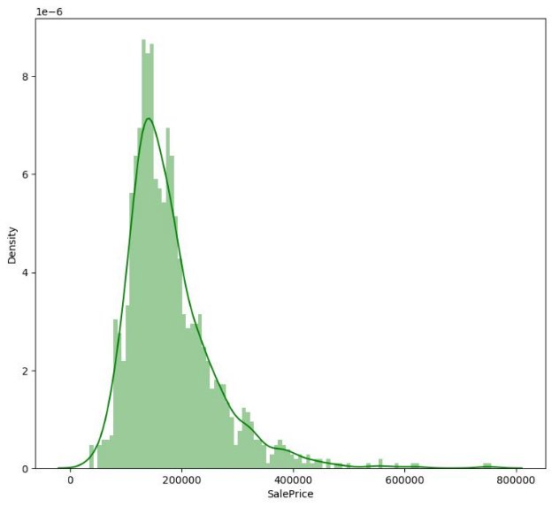

# Ames Real Estate Analysis

## Introduction

## Team & contribution
<table align="center">
   <tr>
      <th align="left">Name</th>
      <th align="left">Sec</th>
      <th align="left">BN</th>
   </tr>
   <tr>
      <td>Reem Emad</td>
      <td>1</td>
      <td>33</td>
   </tr>
   <tr>
      <td>Osama Magdy</td>
      <td>1</td>
      <td>14</td>
   </tr>
   <tr>
      <td>Yousef Gamal</td>
      <td>2</td>
      <td>39</td>
   </tr>
   <tr>
      <td>Ziad Atef</td>
      <td>1</td>
      <td>35</td>
   </tr>
   
</table>

Work distribution:

Reem:

- We already know that Regular lot shape have an average price of 164754 , Can we generalize that for other lot shapes?
- What is the effect of the (Number of fireplaces, Fireplace quality, Type of heating, Central air conditioning) on the Heating quality (We check which of them is in a causal relation with the heating quality)
- Is there a significant difference in the mean SalePrice between properties with and without a pool (PoolArea > 0 vs. PoolArea = 0)

Osama:

- Is it possible to provide the client with where he could search for a house (region) based upon the provided properties and price?
- Given that normal conditions have an average sale price of 184495 , Is that valid for other conditions?
- What are the most 3 variables correlated with the sale price?

Yousef:

- Can we predict the type of heating (Heating) in a property based on its age (YrSold - YearBuilt) and the type of foundation (Foundation)?
- Does the quality of the kitchen (KitchenQual) have a causal effect on the SalePrice of a property, and if so, how strong is the effect?
- How does the style of dwelling affect its sale price?

Ziad:

- Given the different features describing a house is it possible to predict its price? (What is the improvement in sale price while changing the Home functionality from below or equal moderate deductions to above moderate deductions?)
- There are 7 Garage Features ['GarageType', 'GarageYrBlt', 'GarageFinish', 'GarageCars', 'GarageArea', 'GarageQual', 'GarageCond'] . Is there any correlation between those features ? and if there is, can any of them be removed?
- What is the distribution of SalePrice in the dataset, and is it skewed or normal?

Q1. What is the distribution of SalePrice in the dataset, and is it skewed or normal? [Ziad, Descriptive]

SalePrice follows Normal Distribution with mean = 180921.195890, and std = 79442.502883, It is left skewed normal distribution

Q2. Is there a significant difference in the mean SalePrice between properties with and without a pool (PoolArea > 0 vs. PoolArea = 0)? [Reem, Descriptive(meh)]

According to the hypothesis testing we had made on the data, by splitting the data into 2 categories by the Pool Area equal than zero, and greater than zero, and that is the results we observed: there is no significant difference in the mean SalePrice between properties with and without a pool.

Which means that the Pool Area does not affect the price of the house.

Q3. What are the most 3 variables correlated with the sale price? [Osama, Exploratory]

1. OverallQual
1. GrLivArea
1. GarageCars

In summary, the result suggests that houses with higher overall quality, larger living area, and bigger garage tend to have a higher sale price.

Q4. There are 7 Garage Features ['GarageType', 'GarageYrBlt', 'GarageFinish', 'GarageCars', 'GarageArea', 'GarageQual', 'GarageCond'] . Is there any correlation between those features ? and if there is, can any of them be removed? [Ziad, Exploratory]

1. Stating and refining question
1. Set expectations: This is an essential question that needs to be answered and would benefit the company deeply.
1. Collect data: Answering this question will give us insights about relations between different garage features (& their relations with the Sale price) which can help for substituting the absence of the one of the features despite garage features being important
1. Match expectations & data: Our expectations was matching with the data collected and this question is found to be of high importance for the company
2. EDA
1. **Set expectations**: Data should be appropriate after it undergoes cleaning
2. **Collect data**:Upon exploring data it is found to be having a column (GarageYrBlt) which has a mixture of numerical and string values which is replaced with -1. GarageType, GarageFinish, GarageQual are complete string features which needed encoding (conversion to numerics) to get correlations
2. **Match expectations & data**: After Cleaning data is ready for building our model
3. Building models
1. Set expectations: To be able to get correlation between different features
1. Collect data: Correlation between features was calculated and found to be as follows:

Also Correlation with price was calculated to drop unimportant features:

3. Match expectations & data : Our expectation and data was matched
4. Results Interpretation
1. Set expectations: Results interpretation provides meaningful answer to the question
1. Collect data: From the Garage Columns There was [GarageArea, GarageCars] has large correlation so GarageArea is removed, also GarageType has very low correlation with all Garage Features and SalesPrice so it is dropped also, and the GarageYrBlt has very small corr with SalesPrice also, as shown from the 2 below figures
1. Match expectations & data: Expectation Is matched as all important values are reported and interpreted.
5. Communicating results (Evaluated in presentation and discussion)
1. Set expectations: Be able to communicate data to the audience
1. Collect data
1. Match expectations & data

Q5. How does the style of dwelling affect its sale price? [Youssef, Exploratory]

Noting that there are the meaning of all of the values of the dwelling:

- "1Fam" means a single-family detached home.
- "TwnhsE" means a townhouse end unit (house attached on one side).
- "Duplex" means a duplex (a building with two separate living units).
- "Twnhs" means a townhouse (house attached on both sides).
- "2fmCon" means a two-family conversion; a building originally built as a single-family home that has been converted to two separate living units.

And that is the distribution of the sales price according to the different style of dwelling

From the above boxplot we found out that the 1Fam style have higher price ranges and Duplex BldgType has lower price ranges

Then we need to validate that using Hypothesis testing between each 2 of the possible values for that feature, and that is the results of the testing

1. the style of dwelling (1Fam vs TwnhsE) does not have a significant effect on its sale price.
1. There is a significant difference between 1fam, duplex and 1 fam has higher sales prices
1. There is a significant difference between 1fam, twnhs and 1 fam has higher sales prices
4. There is a significant difference between 1fam, 2fam and 1 fam has higher sales prices (but less difference than the previously 2 mentioned ones
4. There is a significant difference between twnhse, duplex and twnhse has higher sales prices
4. There is a significant difference between twnhse, twnhs and twnhse has higher sales prices
4. There is a significant difference between twnhse, 2fam and twnhse has higher sales prices
4. The 2 styles df\_duplex, df\_twnhs, has no significant impact over SalesPrice (twnhs slightly higher than duplex)
4. The 2 styles df\_duplex, df\_2fmcon have no significant impact over SalesPrice.
4. The 2 styles df\_twnhs, df\_2fmcon have no significant impact over SalesPrice.

Q6. Given that normal conditions have an average sale price of 184495 , Is that valid for other conditions? [Osama, Inferential]

In order to solve this condition we tried to investigate if there is a proximity of the average sale price depending on the conditions it was found that:

Artery 241591.666667

Feedr 263642.148148

Norm 365664.897600

PosA 550875.000000

PosN 500059.210526

RRAe 328400.000000

RRAn 321301.615385

RRNe 106600

RRNn 309150.000000

It is visible that there is a change in average sale price with different lots but we need to check for statistical significance.

We used anova test to check means of values and results was introduced to be :F statistic: [3.94207826]

P-value: [1.93692904e-07]

So it was found that we can’t generalize for whole distribution

Q7. We already know that Regular lot shape have an average price of 164754 , Can we generalize that for other lot shapes? [Reem, Inferential]

In order to solve this condition we tried to investigate if there is a proximity of the average sale price depending on the conditions it was found that:

IR1 206101.665289

IR2 239833.365854

IR3 216036.500000

Reg 164754.818378

It is arguable that they may be close enough (except for Reg). We used anova test to check means of values and results was introduced to be :F F statistic: [40.13285166]

P-value: [6.44752385e-25]

So it was found that we can’t generalize for whole distribution

Q8. Can we predict the type of heating (Heating) in a property based on its age (YrSold - YearBuilt) and the type of foundation (Foundation)? [Yousef, Predictive]

1. Stating and refining question
1. Set expectations: This is an essential question that needs to be answered and would benefit the company deeply.
1. Collect data: Answering this question Became crucial due to the significance of the heating feature for the heating quality so being able to predict it would be useful
1. Match expectations & data: Our expectations was matching with the data collected and this question is found to be of high importance for the company
2. EDA
1. **Set expectations**: Data should be appropriate after it undergoes cleaning
1. **Collect data**:Upon exploring data it is found to be categorical features that need encoding.
   1. Data encoding: Binary data is encoded into {0,1}, meanwhile others are encoded into one-hot vectors.
1. **Match expectations & data**: After Cleaning data is ready for building our model and visualizing distribution it is found that more data needs to be collected in ordered to get accurate results
3. Building models
1. Set expectations: Model should be able to predict heating type with reasonable accuracy
1. Collect data: Logistic regression model was used and trained to predict data, Accuracy = 0.9840182648401826
1. Match expectations & data : Our expectation and data was matched but model was not compatible this appears in this confusion matrix and this will probably lead us back to the data distribution

4. Results Interpretation
1. Set expectations: Results interpretation provides meaningful answer to the question
1. Collect data: Model was able to achieve high classification accuracy but that was only because there was one class that dominated the dataset
1. Match expectations & data: Expectation Is matched as all important values are reported and interpreted.
5. Communicating results (Evaluated in presentation and discussion)
1. Set expectations: Be able to communicate data to the audience
1. Collect data
1. Match expectations & data

Q9. Given the different features describing a house is it possible to predict its price? (What is the improvement in sale price while changing the Home functionality from below or equal moderate deductions to above moderate deductions?) [Ziad, Predictive]

6. Stating and refining question
1. Set expectations: This is an essential question that needs to be answered and would benefit the company deeply.
1. Collect data: Answering this question will provide 2 major advantages for the company: first being able to predict how any renovations would affect the sale price to help decide faster wither to perform such renovations or not, secondly it will be a great help for our client and our agents helping them to faster choose the suitable home.
1. Match expectations & data: Our expectations was matching with the data collected and this question is found to be of high importance for the company
7. EDA
1. **Set expectations**: Data should be appropriate after it undergoes cleaning
1. **Collect data**:Upon exploring data it is found to be having missing values, outliers, and categorical features that need encoding.
   1. Data imputation: multi-level imputation is done. First, features having more that 80% of the data missing are dropped. Then, Data with few missing values are imputed with the mode. After that numerical features are imputed with the mean
   1. Data encoding: Binary data is encoded into {0,1}, meanwhile others are encoded into one-hot vectors.
   1. Outliers: IQR is used to detect outliers and points having values above upper limit is set to the upper limit. Points having values below the lower limit are set to the lower limit.
1. **Match expectations & data**: After Cleaning data is ready for building our model
8. Building models
1. Set expectations: Model should be able to estimate price with margin of error of less than 10% of the actual price
1. Collect data: multiple models are trained with randomized search over the model parameters to get best model parameters:
1. RF: best model parameters was found to be:
1. {'n\_estimators': 1355, 'min\_samples\_split': 4, 'max\_features': 'sqrt', 'max\_depth': 22}
1. Model performance:
1. Mean absolute error:16279.227573091057
1. Mean squared error:25567.8824729713

5\.

2. LGBM: best model parameters was found to be:
1. {'n\_estimators': 1000, 'learning\_rate': 0.1, 'colsample\_bytree': 0.5}
1. Model performance:
1. Mean absolute error:17186.577738562894
1. Mean squared error:26418.390414036377
3. CatBoost: best model parameters was found to be:
1. {'depth': 6, 'iterations': 500, 'learning\_rate': 0.1}
1. Model performance:
1. Mean absolute error:15638.595913725061
1. Mean squared error:23855.516144771584
4. XGBoost: best model parameters was found to be:
1. {'subsample': 0.7, 'n\_estimators': 1000, 'max\_depth': 5, 'learning\_rate': 0.01}
1. Model performance:
1. Mean absolute error:17920.640694444446
1. Mean squared error:31310.259699604107
3. Match expectations & data : Our expectation and data was matched
9. Results Interpretation
1. Set expectations: Results interpretation provides meaningful answer to the question
1. Collect data: Upon comparing mean errors resulted in regression and average home price it is found the RF and catboost was able to achieve an error less that 10% of the house price
1. Match expectations & data: Expectation Is matched as all important values are reported and interpreted.
10. Communicating results (Evaluated in presentation and discussion)
1. Set expectations: Be able to communicate data to the audience
1. Collect data
1. Match expectations & data

Q10. Is it possible to provide the client with where he could search for a house (region) based upon the provided properties and price?[Osama, predictive]

1. Stating and refining question
1. Set expectations: This is an essential question that needs to be answered and would benefit the company deeply.
1. Collect data: Answering this question will provide 2 major advantages for the company: first being able to predict how any renovations would affect the sale

price to help decide faster wither to perform such renovations or not, secondly it will be a great help for our client and our agents helping them to faster choose the suitable home.

3. Match expectations & data: Our expectations was matching with the data collected and this question is found to be of high importance for the company
2. EDA
1. **Set expectations**: Data should be appropriate after it undergoes cleaning
1. **Collect data**:Upon exploring data it is found to be having missing values, outliers, class imbalance and categorical features that need encoding.
   1. Data imputation: multi-level imputation is done. First, features having more that 80% of the data missing are dropped. Then, Data with few missing values are imputed with the mode. After that numerical features are imputed with the mean
   1. Data encoding: Binary data is encoded into {0,1}, meanwhile others are encoded into one-hot vectors.
   1. Outliers: IQR is used to detect outliers and points having values above upper limit is set to the upper limit. Points having values below the lower limit are set to the lower limit.
   1. Class imbalance: data oversampling is done to overcome class imbalance
1. **Match expectations & data**: Despite above mentioned preprocessing but classes distribution causes extreme class imbalance which will most probably affect the model results.

Neighborhood 12 171 5 114 17 81 7 78 21 64 14 59 19 57 8 57 16 57 3 43 6 40 20 39 11 36 15 28 23 28 9 26 18 21 22 19 4 19 10 16 2 13 0 10

24 9

13 8 1 2

3. Building models
1. Set expectations: Model should be able to predict neighborhood with acceptable accuracy
1. Collect data: multiple models are trained with randomized search over the model parameters to get best model parameters:
- RF: best model parameters was found to be:

{'n\_estimators': 777, 'min\_samples\_split': 5, 'max\_features': 'auto', 'max\_depth': 43}

Model performance:

Accuracy: 0.6767123287671233

- SVM: Model performance: Accuracy score: 0.10136986301369863
- NB:Model performance:

Accuracy: 0.3315068493150685

3. Match expectations & data : Accuracy of the RF is acceptable but dataset needs to be revisited
4. Results Interpretation
1. Set expectations: Results interpretation provides meaningful answer to the question
1. Collect data: From the trained classifiers it is obvious that the RF model is far better than the other models so it will be the one used.
1. Match expectations & data: Expectation Is matched as all important values are reported and interpreted.
5. Communicating results (Evaluated in presentation and discussion)
1. Set expectations: Be able to communicate data to the audience
1. Collect data
1. Match expectations & data

Q11. What is the effect of the (Number of fireplaces, Fireplace quality, Type of heating, Central air conditioning) on the Heating quality (We check which of them is in a causal relation with the heating quality)[Reem, Causal]

1. Stating and refining question
1. Set expectations: This is an essential question that needs to be answered and would benefit the company deeply.
1. Collect data: Due to decrease of temperature in the city during winter to below 0c and the continuous decreasing of the overall average temperature due to climate changes heating systems need to be analyzed to check for quality
1. Match expectations & data: Our expectations was matching with the data collected and this question is found to be of high importance for the company
2. EDA
1. Set expectations: Data is appropriate to answer our question
1. Collect data:
1. Upon exploring the distributions of the independent variables it is found that:
1. FireplaceQu : Despite having some values more represented in the dataset than other put distribution is sufficient enough for causal analysis to be done also chi2 test is undergone to ensure correlation before testing for causality.

1\. 

3. Fireplaces: Despite the data being left skewed but it is sufficient enough to undergo causal analysis. Correlation was also tested and was found to be true.

1\. 

4. Heating & CentralAir: Despite being correlated with the heating quality, the extreme left skewing of the data would probably cause the analysis to be biased.
1. 

2. Further note regarding Heating upon the decomposition of the GasA feature which is the majority of the houses it was found to contain a significant percentage of each heating quality. So, further analysis for this feature only is needed.
3. 
3. Match expectations & data: Despite the data allowing us to perform causal analysis on some features. More data is needed for the analysis of the remaining features. And more data regarding GasA is needed to be collected because it seems like a significant feature.
3. Building models
1. Set expectations: Models will be able to provide unbiased causal analysis
1. Collect data: "difference-in-differences" is a statistical technique used to estimate the causal effect of a treatment or policy intervention on an outcome variable and will be used. DiD can be estimated either from the means before and after treatment or by using a regressor(Later will be used).
1. LinearRegression from sklearn is used and trained on data to produce coefficients.
1. array([-0.07492894, -0.6144922 , 0.34765391])
1. Here we find that DiD is 0.34765391
1. Another regressor is used to validate the results and it is found to be:
5. 
3. Match expectations & data : Our expectation and data was matched
4. Results Interpretation
1. Set expectations: Results interpretation provides meaningful answer to the question
1. Collect data: Upon examining the DiD value it shows that there is indeed a causal effect but the extent of this effect is relatively low. Also upon converting the t-value generated above to a p-value it is can be said the this is not statistically significant
1. Match expectations & data: Expectation Is matched as all important values are reported and interpreted.
5. Communicating results (Evaluated in presentation and discussion)
1. Set expectations: Be able to communicate data to the audience
1. Collect data
1. Match expectations & data

Q12. Does the quality of the kitchen (KitchenQual) have a causal effect on the SalePrice of a property, and if so, how strong is the effect?[Youssef, Causal]

To solve this problem we tried a different technique which is pearson correlation. From the analysis we find that results was:

The correlation coefficient is: 0.660, The p-value is: 5.051357364029292e-183

The relationship between KitchenQual and SalePrice is not due to chance, but rather there is a real causal effect between the two variables.

Final Findings & Results

Assuming the case where we are working at a firm the results can be interpreted in three main issues:

- In acquisition of houses we should be focusing on features that are more correlated to the price Like Overall quality (Expected), Garage size(Unexpected). In home renovations it may not be important to renovate the kitchen or bedrooms but the basement is more important. And we should absolutely get away from fancy looking features that are useless like pools. Also in lands acquisitions positions and lot shapes are extremely important
- We were able to provide well performing models that were able to help our agent speed up their search process which leads to profit margin increasing.
- We studied some factors that will be important for the future like heating as effects of climate change are worsening continuously.

Final Findings & Results

Future work mainly consist of gathering more data either to be able to represent some features better (like Heating for example) or introduction of data that was not existent before (GasA for example)
